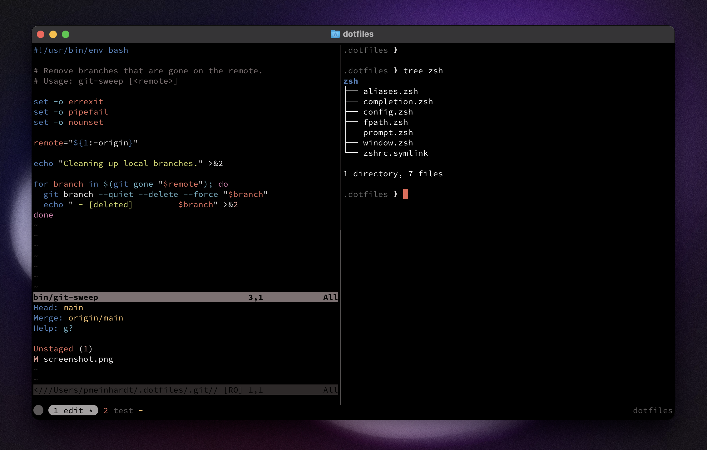

# dotfiles

Your [dotfiles](https://dotfiles.github.io/) are how you personalize your system.

Here’s how I set up mine.



## Installation

Your first step is to clone this repository:

```sh
git clone https://github.com/pmeinhardt/dotfiles.git ~/.dotfiles
```

```sh
./bin/dot bootstrap
./bin/dot configure
./bin/dot install
```

```sh
# Change into the new directory
cd ~/.dotfiles
```

```sh
# Run the bootstrap script
./script/bootstrap
```

This will symlink the appropriate files to your home directory.

The `bin/dot` tool is a simple helper which installs dependencies, sets sane OS defaults, and so on.
Tweak and occasionally run `dot` to keep your environment fresh and up-to-date.

## About

Everything’s built around topic areas. Each topic has its own directory.

There are a few special files in the hierarchy.

- **Brewfile**: Contains a list of tools for [Homebrew](https://github.com/Homebrew/brew) to install. You might want to edit this file before running any initial setup.
- **bin/**: Anything in here will be available on your `$PATH`.
- **topic/\*.zsh**: Files ending in `.zsh` get loaded into your environment.
- **topic/path.zsh**: Files named `path.zsh` are loaded first and are expected to set up `$PATH` or similar.
- **topic/completion.zsh**: Files named `completion.zsh` are loaded last and are expected to set up autocomplete.
- **topic/install.sh**: Files named `install.sh` are executed when you run `script/install`. To avoid being loaded automatically, their extension is `.sh`, not `.zsh`.
- **topic/\*.symlink**: Files named `*.symlink` get symlinked into your `$HOME`. This is so you can keep them versioned in your dotfiles repo while also making them available in your home directory.


- `~/.zsh/path`, `~/.zsh/init`, then `~/.zsh/completion`
- `$topic/dot-zsh`

[Ghostty](https://github.com/ghostty-org/ghostty)
[GNU Stow](https://www.gnu.org/software/stow/)

## Thanks

This project started as a fork from [Zach Holman](https://github.com/holman)’s neat [dotfiles](https://github.com/holman/dotfiles) with a growing number of my own changes, pulling in pieces from [Carlos Alexandro Becker](https://github.com/caarlos0/dotfiles), [Gary Bernhardt](https://github.com/garybernhardt/dotfiles), [Gianni Chiappetta](https://github.com/gf3/dotfiles), [Jan Moesen](https://github.com/janmoesen/tilde), [Mathias Bynens](https://github.com/mathiasbynens/dotfiles), [Nick Nisi](https://github.com/nicknisi/dotfiles), [Tim Pope](https://github.com/tpope/tpope), and many more.

Special thanks to [Tim Pope](https://github.com/tpope/) for his excellent Vim plugins.
